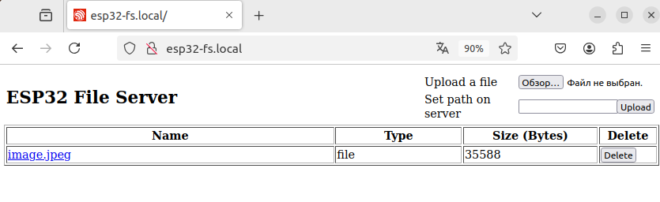

# esp32_http_file_server
Simple HTTP File Server Example

## Requirements
- Ubuntu 22.04 LTS
- [ESP-IDF v5.4](https://docs.espressif.com/projects/esp-idf/en/v5.4/esp32s3/index.html)
- [ESP32-S3-DevKitC-1](https://docs.espressif.com/projects/esp-idf/en/latest/esp32s3/hw-reference/esp32s3/user-guide-devkitc-1.html)

## Links

- [HTTP Server](https://docs.espressif.com/projects/esp-idf/en/v5.4/esp32s3/api-reference/protocols/esp_http_server.html)
- [Simple HTTP File Server Example](https://github.com/espressif/esp-idf/tree/release/v5.4/examples/protocols/http_server/file_serving)
- [mDNS Service](https://docs.espressif.com/projects/esp-protocols/mdns/docs/latest/en/index.html)

## Building
- Get ESP-IDF
```
$ mkdir -p ~/esp
$ cd ~/esp
$ git clone -b v5.4 --recursive https://github.com/espressif/esp-idf.git esp-idf-v5.4
$ cd esp-idf-v5.4
$ export IDF_TOOLS_PATH="$HOME/idf-tools-v5.4"
$ ./install.sh
```
- Set up the environment variables
```
$ . $HOME/esp/esp-idf-v5.4/export.sh
```
- Clone and setup [project](https://github.com/akhud78/esp32_http_file_server)
```
$ cd ~/esp
$ git clone https://github.com/akhud78/esp32_http_file_server
$ cd ~/esp/esp32_http_file_server
$ git submodule update --init --recursive
```
- Set the chip target to build
```
$ idf.py set-target esp32s3
```
- Add [mDNS Service](https://components.espressif.com/components/espressif/mdns) component
```
$ idf.py add-dependency "espressif/mdns^1.4.3"
```
- Add [wi-fi component](https://github.com/akhud78/esp32_wifi) into `components` folder.
- Change build [Configuration](docs/config.md)

## Run
- Connect development board to your computer and run
```
$ cd ~/esp/esp32_http_file_server
$ idf.py -p /dev/ttyUSB0 flash monitor
...
I (709) wifi: got ip:192.168.1.129
I (719) wifi: connected to ap SSID:Keenetic-1234 password:qwerty42
I (729) app: mdns hostname set to: [esp32-fs]
I (729) example_mount: Initializing SPIFFS
I (769) example_mount: Partition size: total: 836081, used: 36144
I (769) file_server: Starting HTTP Server on port: '80'
I (769) app: File server started
I (1619) wifi:<ba-add>idx:0 (ifx:0, 50:ff:20:58:60:12), tid:0, ssn:2, winSize:64
```
- Upload files to `ESP32 File Server`
    - [image.jpeg](docs/image.jpeg)
    - [mobydick.html](docs/mobydick.html) 
- Open [esp32-fs.local](http://esp32-fs.local/) and check.



```
...
I (122469) file_server: Found file : image.jpeg (35588 bytes)
I (124909) file_server: Sending file : /image.jpeg (35588 bytes)...
I (124989) file_server: File sending complete
I (124989) file_server: bytes=35588 run_time_ms=82 bps=3472000
```
- To exit IDF monitor use the shortcut `Ctrl+]`.

## Flashing the prebuild Binaries

- Get and install [esptool](https://github.com/espressif/esptool):

```
cd ~
python3 -m pip install pyserial
git clone https://github.com/espressif/esptool
cd esptool
python3 setup.py install
```

Go to `esp32_http_file_server` project directory and build for any kind of esp32 target.

- For esp32s3:

```bash
esptool.py --port /dev/ttyACM0 erase_flash
esptool.py --chip esp32s3 --port /dev/ttyACM0 \
--before=default_reset --after=hard_reset write_flash \
--flash_mode dio --flash_freq 80m --flash_size detect \
0x0 build/esp32s3/bootloader.bin \
0x8000 build/esp32s3/partition-table.bin \
0x10000 build/esp32s3/esp32_http_file_server.bin
```

As an alternative you might use [Espressif's Flash Download Tools](https://www.espressif.com/en/products/hardware/esp32/resources).

## Usage
- [Tests](docs/tests.md)